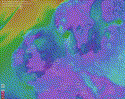
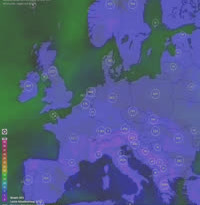
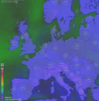
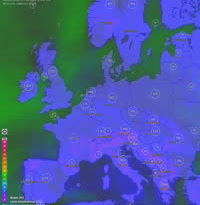
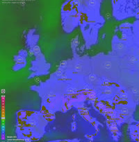
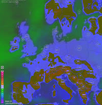
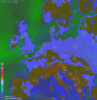
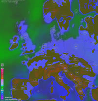

# Purpose
Sometimes you don't have raw data (numbers) to create a Heat Map, but only have
images, like from a weather simulation. Overlaying, combining or blending these
images can also create a "Heat Map" (or: Track Map").
That is what this simple program is for.

# Example
The example uses several images of a map showing the wind strength every three hours
of some days. The result is a "heat map" of the wind power, averaged about this time.

## Input
This is a gif animation of several images. These single images will later be processed
to get a "heat map".(Note: The gif animation only shows a part of the images which are
later used.):



## cmd
```bash
$ cd src; javac ImageHeatMapper
$ java ImageHeatMapper $pathToYourImages.png  [$saturateFactor [$filenameOfResult.png]]
```
## Result

These results were done on an input from mid February 2023 to beginning of March 2023.
They are all based on the same computed Heat Map, but with different saturation levels:

saturation factor (1.0):

saturation factor (1.3):

saturation factor (1.6):

saturation factor (1.7):

saturation factor (1.8):

saturation factor (1.9):

saturation factor (2.0):


# Explanation
The result with "saturation factor (1.0)" reflects the blending without postprocessing.
This result, as it is an averaged blending, often doesn't show clearly the "heat".
To improve this, a postprocessing with increasing saturation of color, can be applied.
Starting with saturation factor of 1.6 there appears brownish colors which shows
low wind power.

## How to use "ImageHeatMapper"
Go to the src directory and compile the class using java:
```bash
$ cd src; javac ImageHeatMapper
```
Call the program. Mandatory parameter is the path to the input files (must end on "png"):
```bash
$ java ImageHeatMapper $pathToYourImages.png
```
Here default values are used:
- "blended.png" is the name of the result written as file
- the saturation factor is "1.0" , i.e. no saturation manipulation is done

You can change the default values:
```bash
$ cd src; javac ImageHeatMapper
$ java ImageHeatMapper $pathToYourImages.png  [$saturateFactor [$filenameOfResult.png]]
```
If you just want to change the saturation of one image (e.g. the result image):
create a directory, copy the resulted png to it, use that as input for "ImageHeatMapper" and change the saturation factor. The image will be blended into itself (which has no effect) and
the saturation factor is used on it.

# Bottom line
I am not totally happy with the result, but it's a start.
